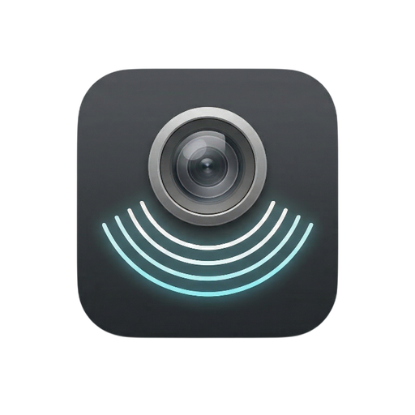

# KeyGlow

<p align="center">
  
</p>

A lightweight macOS menu bar app that automatically turns your **Elgato Key Light** on and off based on your camera activity. When your camera starts streaming, the light turns on. When the stream stops, it turns off.

No background script, no terminal window — just a native menu bar icon.

## How it works

- Monitors macOS system logs for UVC camera events (`Start Stream` / `Stop Stream`)
- Discovers the Key Light on the local network by resolving the hostname `elgato-key-light` (the OS appends your configured DNS search domain, e.g. `elgato-key-light.fritz.box`). Falls back to `elgato-key-light.local` via Bonjour/mDNS
- Controls the light via the [Elgato Lights HTTP API](https://github.com/adamesch/elgato-key-light-api) (`PUT /elgato/lights`)
- Runs as a menu bar-only app (no Dock icon)

## Menu bar

| Item | Description |
|---|---|
| `Key Light: <ip>` | Resolved IP address, or "Not Found" |
| `Camera: Active / Inactive` | Current camera state |
| `Light: ON / OFF` | Current light state |
| `Auto Mode: ON / OFF` | Toggle automatic on/off with camera |
| `Turn Light On / Off` | Manual override |
| `Brightness` | Slider to adjust brightness (3–100%) |
| `Color Temperature` | Slider to adjust color temperature (2900K–7000K) |
| `Rediscover Key Light` | Re-run DNS discovery |
| `Quit` | Exit the app |

## Requirements

- macOS 13+ (Ventura or later)
- An Elgato Key Light connected to the same local network

## Development

Build and run in debug mode:

```sh
swift build
.build/debug/KeyGlow
```

Or using the Makefile:

```sh
make run
```

## Build

Produce a release `.app` bundle:

```sh
make bundle
```

The output is `KeyGlow.app` in the project root. You can move it to `/Applications` like any other macOS app.

## Tech stack

| Layer | Technology |
|---|---|
| Language | Swift |
| UI framework | AppKit (NSStatusItem + NSMenu) |
| Light control | URLSession (Elgato HTTP API) |
| Camera detection | `log stream` subprocess (UVC extension events) |
| Host discovery | CFHost (system DNS + mDNS) |
| Build system | Swift Package Manager |
